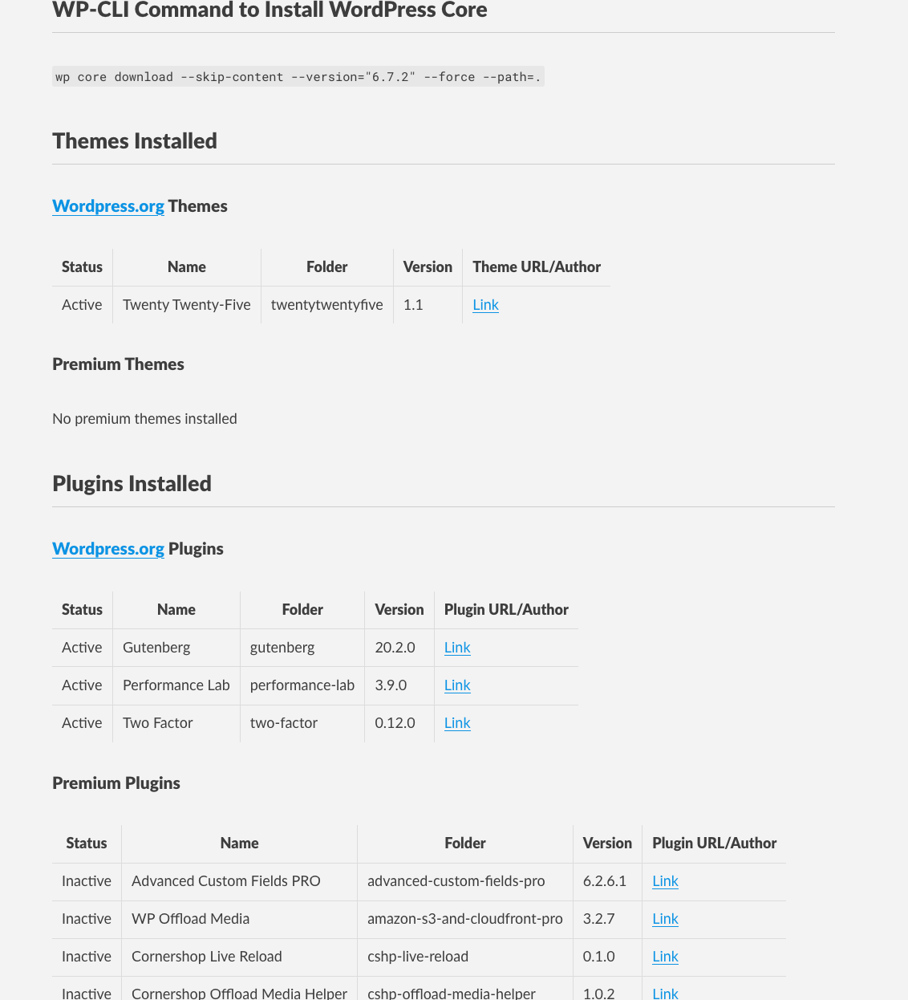
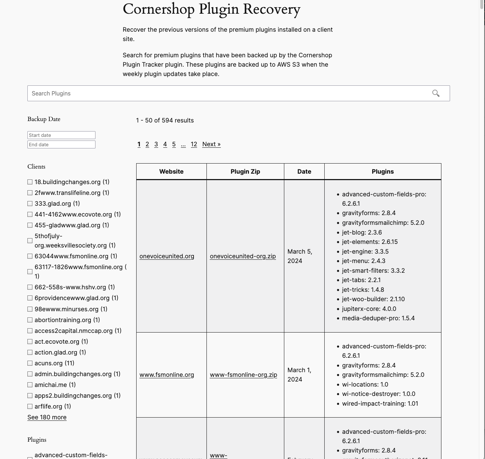
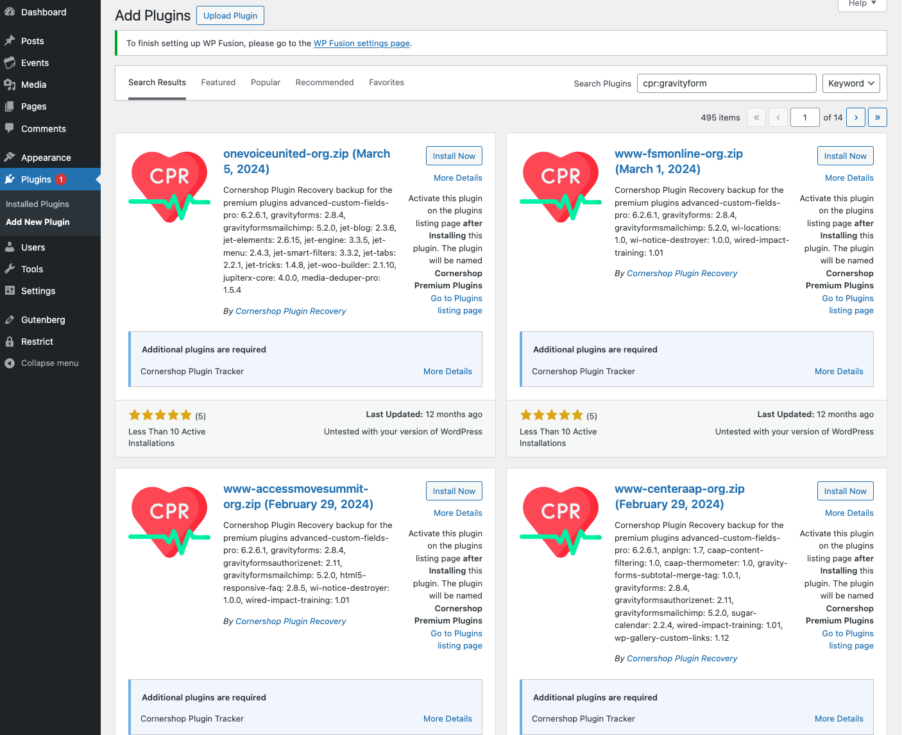
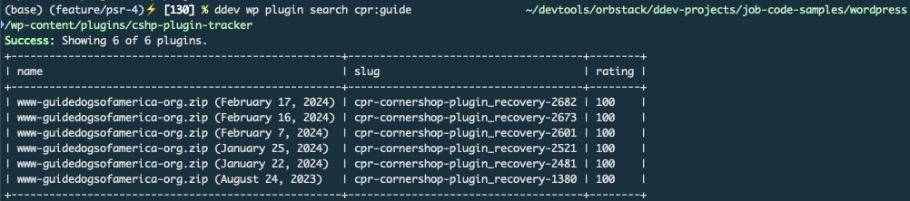

# Cornershop Plugin Tracker

A WordPress plugin that tracks installed WordPress core, themes, and plugins; backs up premium plugins, and streamlines plugin management.

## My Contributions
I designed, built, and maintained this plugin from its inception. While I welcomed collaboration, I served as the primary developer and sole maintainer because the rest of the team was focused on client-facing projects. My role allowed me to concentrate on improving our internal processes and workflows through this plugin’s development.

## Core Technologies
- **WordPress** – Plugin development and core integration.
- **PHP** – Primary language for plugin logic and REST API handling.
- **JavaScript/TypeScript** – Supporting scripts interactions on the admin settings page.
- **Third-Party APIs** – Integration with WordPress.org and the Cornershop Plugin Recovery service.
- **CI/CD Pipelines** - Continuous Integration with Github Action file [build.yml](.github/workflows/build.yml) that verifies unit and integration tests have passed. Continuous Deployment with Bitbucket pipelines integration [bitbucket-pipelines.yml](bitbucket-pipelines.yml) that handled the deployment of the final plugin zip file.

## Main files to evaluate
- [cshp-plugin-tracker.php](cshp-plugin-tracker.php)
- [src/Plugin_Tracker.php](src/Plugin_Tracker.php)
- [src/Backup.php](src/Backup.php)
- [src/Archive.php](src/Archive.php)
- [src/WP_CLI.php](src/WP_CLI.php)
- [_assets_src/js/admin.ts](_assets_src/js/admin.ts)
- [src/Admin.php](src/Admin.php)
- [src/Logger.php](src/Logger.php)
- [src/Utilities.php](src/Utilities.php)

## Inspiration
This project was inspired by [WP-Composer](https://github.com/rxnlabs/wp-composer), an open-source WP-CLI tool I created and presented at [WordCamp Baltimore 2016](https://wordpress.tv/2016/11/21/deyonte-wilkinson-managing-wordpress-dependencies-in-single-and-multisite-environments/). The biggest challenge in that earlier solution was handling premium plugins not hosted on WordPress.org—Cornershop Plugin Tracker aims to solve that gap.

## Overview

Cornershop Plugin Tracker was created to solve a key problem we were having with our client sites: large Git repositories filled with third-party code (WordPress core, themes, plugins). This plugin **automatically generates** two key files in your `wp-content/uploads/cshp-plugin-tracker` folder:

1. **`composer.json`** – Lists all installed plugins, themes, and WordPress core versions.
2. **`README.md`** – Summarizes the installed WP core, themes, and plugins (including versions) for quick reference.

By tracking the installed versions of a WP core, third-party plugins, and third-party themes, these items can stop being tracked in the main Git repository for the website.

### Composer.json format
```json
{
  "name": "wordpress59playground/wordpress",
  "description": "Installed plugins and themes for the WordPress install https://wordpress.deyonte.cshp.co",
  "type": "project",
  "repositories": [{
    "type": "composer",
    "url": "https://wpackagist.org",
    "only": [
      "wpackagist-plugin/*",
      "wpackagist-theme/*"
    ]
  },
    {
      "type": "package",
      "package": {
        "name": "cshp/premium-plugins",
        "type": "wordpress-plugin",
        "version": "1.0",
        "dist": {
          "url": "https://wordpress.deyonte.cshp.co/wp-json/cshp-plugin-tracker/plugin/download?token=6532d19f-65ac-4e51-baf6-81960905f804",
          "type": "zip"
        }
      }
    }
  ],
  "require": {
    "cshp/wp": "6.1.1",
    "premium-plugin/backupbuddy": "8.7.4.0",
    "premium-plugin/cshp-support": "1.0.0",
    "premium-plugin/elementor-pro": "3.5.2",
    "premium-theme/blocksy-child": "1.0.0",
    "wpackagist-plugin/classic-editor": "1.6.2",
    "wpackagist-plugin/debug-bar": "1.1.3",
    "wpackagist-theme/blocksy": "1.8.53"
  },
  "extra": {
    "installer-paths": {
      "wordpress/plugins/${name}": [
        "type:wordpress-plugin"
      ],
      "wordpress/themes/${name}": [
        "type:wordpress-theme"
      ]
    }
  }
}
```

### README.md format


## The main benefits of the plugin.

- **Cleaner Repos** – Only custom code ends up in version control; third-party code is installed on demand.
- **Easier Staging/Dev Environments** – Spin up WordPress core and standard plugins/themes quickly without bundling them in Git.
- **Simple Premium Plugin Management** – Keep premium plugins backed up and easily recoverable, regardless of direct license access.
- **Enhanced Version Recovery** – Access previous versions of premium plugins via the Cornershop Plugin Recovery site whenever you need to roll back.

## Important Note for Testing
If you decide to download and test this plugin, you will need to have a local or remote WordPress website set up using an administrator email address from either **@wideeyecreative.com** or **@wideeye.co**. This requirement ensures access to the plugin’s settings and additional functionality.

## More Details
### Key Features

1. **Track & Document Third-Party Code**
   - Automatically detects installed WP core, theme, and plugin versions.
   - Saves them into both a `composer.json` and `README.md` for transparency.

2. **Daily & Weekly Backup of Premium Plugins**
   - Detects “premium” plugins (any plugin not available on WordPress.org).
   - Backs them up daily to AWS S3 and to the Cornershop Plugin Recovery (CPR) website for safe storage and easy retrieval during weekly plugin updates.

3. **Cornershop Plugin Recovery Site**
   - A companion site ([Cornershop Plugin Recovery](https://plugins.cornershopcreative.com)) that stores previous versions of premium plugins installed on client sites.
   - Search for and recover older plugin versions if an update breaks functionality.
   - Premium plugins are automatically backed up by Cornershop Plugin Tracker to CPR each week.

4. **Search & Recover Premium Plugins via Native Plugin Search or WP-CLI**
   - In WordPress Admin, you can search for premium plugins with the prefix `cpr:` (e.g., `cpr:gravityforms`).
   - Supports WP-CLI commands (e.g., `wp plugin install cpr:gravityforms`) to download but **not** auto-activate premium plugins.

5. **Simple WP-CLI Commands**
   - Generate or update the tracking files with `wp cshp-pt generate`.
   - Install premium plugins with `wp cshp-pt plugin-install` (from a local `.zip` or remote URL).
   - Zip and store premium plugins or themes for easy reuse (e.g., `wp cshp-pt plugin-zip`).

### Installation

1. **Download or Clone**
   - Download the `.zip` file from your repo
   - Upload and install via the WordPress admin, or place it in `wp-content/plugins`.

2. **Activate the Plugin**
   - Go to **Plugins → Installed Plugins** → Activate **Cornershop Plugin Tracker**, or run:
     ```bash
     wp plugin activate cshp-plugin-tracker
     ```

3. **(Optional) Access Token**
   - If you need to download premium plugins/themes directly from a site via the REST API, set the **Access Token** under **Settings → Cornershop Plugin Tracker**. Otherwise, leave it empty.

### Usage

1. **Generate Tracking Files**
   - After installation, run:
     ```bash
     wp cshp-pt generate
     ```
     This command creates/updates the `composer.json` and `README.md` in `wp-content/uploads/cshp-plugin-tracker/`.

2. **Search & Recover Premium Plugins**
   - In **Plugins → Add New**, simply type `cpr:` followed by the plugin name (e.g., `cpr:gravityforms`).
   - Similarly, you can run WP-CLI:
     ```bash
     wp plugin install "cpr:gravityforms"
     ```
     Plugins download from Cornershop Plugin Recovery, but are not automatically activated.

3. **Backup Premium Plugins**
   - Cornershop Plugin Tracker periodically backs up premium plugins to AWS S3 and the Cornershop Plugin Recovery site.
   - You can restore previous versions if something breaks during an update.

### Screenshots

Below are some images illustrating how Cornershop Plugin Tracker integrates with the Cornershop Plugin Recovery site and how you can search and recover premium plugins:

1. **Plugin Recovery Site Download Interface**  
     
   *(Download premium plugins from the CPR website.)*

2. **Native WP Plugin Search with `cpr:` Prefix**  
     
   *(Demonstration of searching for premium plugins via the WordPress admin.)*

   

3. **WP-CLI Integration**  
     
   *(Use `wp plugin install cpr:some-plugin` to recover premium plugins.)*

## Frequently Asked Questions
### Why not just not track plugins and rely on WordPress Packagist and Composer?
Great question.

- Not all web host support installing plugins using Composer or have Composer installed. Not all web host even have WP CLI installed.
- We worked with organizations of various sizes and budgets. Not every client can afford a good host that enforce good workflow habits like Pantheon.
- We don’t always deploy code in a way that is suitable to a good workflow. We want to have best practices for both support clients and retainers but we have not found a good middle ground that does not increase maintenance costs for our clients.
- WordPress Packagist is not a project officially supported by the core WordPress team.
- WordPress Packagist does not work with premium plugins not hosted on wordpress.org

## Contributing & Support

- **Issues & PRs** – Feel free to open pull requests or issues in the repository.
- **Further Documentation** – For advanced usage (e.g., `.htaccess` lockdown, Git configuration, removing previously tracked plugins from Git), see the plugin’s extended documentation at [plugin-tracker-detailed-documentation.pdf](docs/files/plugin-tracker-detailed-documentation.pdf) .